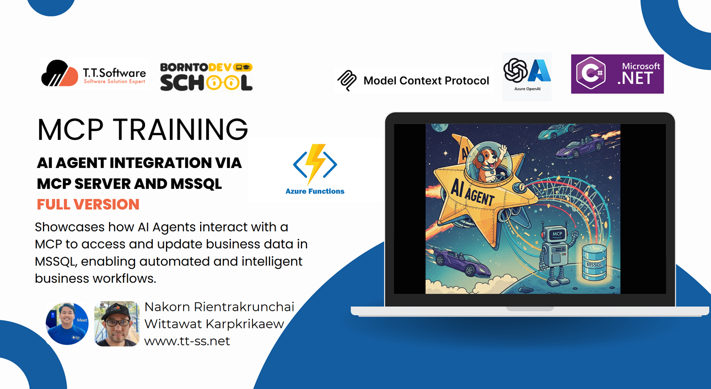
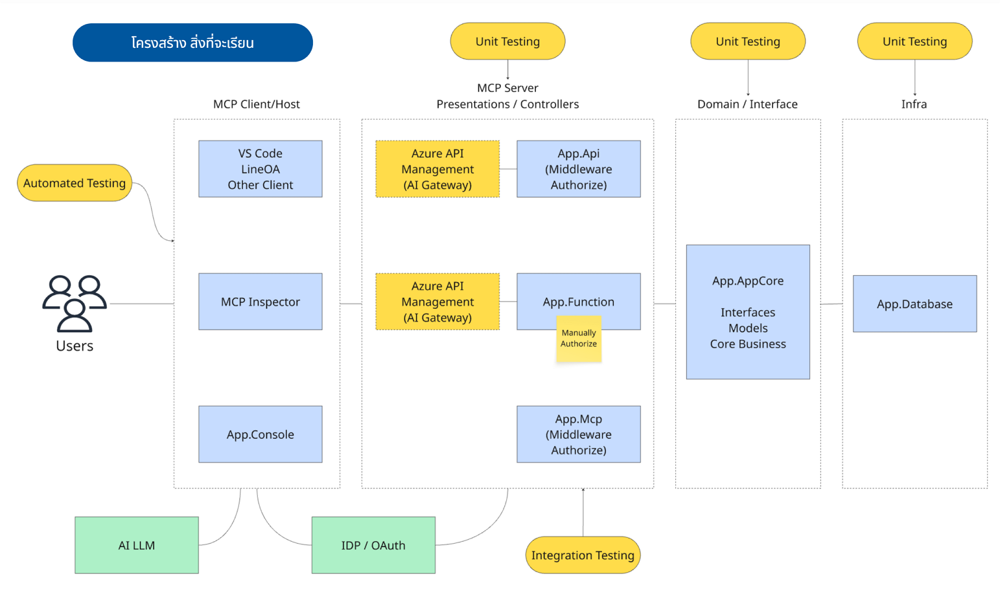

# TTSS Training AI MCP Solution



ที่เก็บโค้ดนี้ประกอบด้วยโซลูชัน .NET แบบโมดูลาร์สำหรับระบบบริหารจัดการบริการ รวมถึง business logic หลัก, API, Azure Functions, ตัวอย่าง console authentication, database และโปรเจกต์นำเสนอ MCP

---

## Training Course Outline

ส่วนนี้เป็นแผนการอบรม MCP โดยจะไล่ตามขั้นตอน ตั้งแต่การเตรียมความพร้อม, LAB, และเนื้อหาสำคัญสำหรับการใช้งาน Model Context Protocol (MCP) ใน .NET, Azure และ VS Code

### 1. Preparation
- DB Connection string
- Azure AD setting
- Azure Function deployment URL + key
- Azure Open AI

### 2. Hello World MCP
- ศึกษา MCP Server ที่เผยแพร่ในสาธารณะ
- mcp/time ใน VS Code
- https://mcp.so/
- https://mcpservers.org/
- modelcontextprotocol/server-postgres ใน VS Code demo

### 3. Knowing MCP
- Introduction
- Architecture
- Transports

### 4. MCP Client in VS Code (2 ways)
- https://code.visualstudio.com/docs/copilot/chat/mcp-servers
- เชื่อมต่อ MCP ที่ deploy บน Azure Function บน Azure
- ทดลองใช้งาน

### 5. MCP Inspector
- https://github.com/modelcontextprotocol/inspector
- เชื่อมต่อ MCP ที่ deploy บน Azure Function บน Azure
- Inspect ดูข้อมูล

### LAB01
- นักเรียนเชื่อมต่อ MCP ที่ deploy บน Azure Function บน Azure ด้วย VS Code
- นักเรียนเชื่อมต่อ MCP ที่ deploy บน Azure Function บน Azure ด้วย MCP Inspector

---

### 6. Calling MCP by Thai vs English language
- รู้ข้อจำกัด
- Road to Agentic AI (อนาคตถ้าต้องการ)

### 7. Study Project Structure
- เข้าใจ Solution
- App.AppCore
- App.Database

### 8. MCP by Azure Function Demo Project
- App.Function
- ข้อจำกัด: Library ยังไม่ GA
- ข้อจำกัด: ต้องจัดการ authorization เอง

### 9. Knowing MCP (Authorization)
- Authorization
- Azure Entra ID
- App Registration (Client side)

### 10. MCP Client Demo Project
- App.Console
- Demo App.Console

### LAB02
- นักเรียนใช้ App.Console เชื่อมต่อ App.Function ใน Local
- Debug เพื่อดู userid/user role ใน log

---

### 11. MCP Security by OAuth
- Authorization
- OAuth basic

### 12. MCP by Web API Demo Project
- App.Mcp
- ป้องกันโค้ดด้วย OAuth Demo (middleware)
- ตรวจสอบ user id/user role ใน log

### LAB03
- นักเรียนใช้ App.Console เชื่อมต่อ App.Mcp ใน Local
- Debug เพื่อดู userid/user role ใน log

---

### 13. Future Experimental
- Expose REST APIs as MCP servers ด้วย Azure API Management และ API Center (ตอนนี้ preview)
- Secure Remote MCP Servers ด้วย Azure API Management
- MCP Server option ไม่แสดงใน API Management
- Testing Architecture

### 14. Create MCP Function from Zero
- ทบทวนแนวทางการทำงานในงานจริง

### LAB04
- เพิ่ม validation ให้ MCP Tool ของ App.Function

---

## Solution Structure

Blue boxes are in this solution.
Orange boxes are suggest future experimental
Green boxes are external system we connect to



```
ROOT/
│
├── AppCore/
│   └── App.AppCore/         # Core models, interfaces, and utilities
│
├── Infra/
│   └── App.Database/        # Entity Framework Core context, migrations, seeding
│
├── Documents/
│   └── building_azure_function_mcp.md  # Training guide for Azure Functions
│
└── Presentations/
    ├── App.Api/             # ASP.NET Core Web API
    ├── App.Function/        # MCP Server by Azure Functions 
    ├── App.Console/         # Console app (Azure Entra ID authentication sample)
    └── App.Mcp/             # MCP Server by Web API
```

## Projects Overview

- **App.AppCore**  
  โมเดลธุรกิจหลัก, DTOs, interfaces, และ utility classes  
  [Read more &rarr;](AppCore/App.AppCore/readme.md)

- **App.Database**  
  Entity Framework Core context, migrations, และ logic สำหรับ seeding database  
  [Read more &rarr;](Infra/App.Database/readme.md)

- **App.Api**  
  ASP.NET Core Web API สำหรับการดำเนินงาน service management  
  [Read more &rarr;](Presentations/App.Api/readme.md)

- **App.Function**  
  Azure Functions สำหรับ business logic แบบ serverless  
  [Read more &rarr;](Presentations/App.Function/readme.md)  
  [Training Guide: Building CustomerFuncTool &rarr;](Documents/building_azure_function_mcp.md)

- **App.Console**  
  ตัวอย่าง console app สำหรับ Azure Entra ID authentication และ API access  
  [Read more &rarr;](Presentations/App.Console/readme.md)

- **App.Mcp**  
  MCP tools และ configuration รวมถึงการตั้งค่าความปลอดภัยด้วย User Secrets  
  [Read more &rarr;](Presentations/App.Mcp/readme.md)

---

## Required Configuration

ก่อนเริ่มใช้งาน solution นี้ ต้องกำหนดค่า configuration สำหรับแต่ละโปรเจกต์ที่เกี่ยวข้อง (เช่น `App.Api`, `App.Function`, `App.Mcp`)

**คุณต้องเตรียม:**

- **Database connection string**: สำหรับเชื่อมต่อ MSSQL database
- **Azure AD settings**: สำหรับ authentication ด้วย Azure Active Directory  
  - *Instance*: URL หลักสำหรับ Azure AD authentication (ปกติคือ `https://login.microsoftonline.com/`)
  - *Domain*: Azure AD domain ของคุณ เช่น `[domain].onmicrosoft.com`
  - *TenantId*: รหัส tenant ของ Azure AD
  - *ClientId*: Application (client) ID ที่ลงทะเบียนใน Azure AD
  - *Audience*: audience ที่คาดหวังสำหรับ token เช่น `api://[ClientId]`
- **Azure Function Deployment**:
  - *Function URL*: URL ของ Azure Function ที่ deploy แล้ว (เช่น `https://yourfunctionapp.azurewebsites.net`)
  - *MCP Extension Key*: function key สำหรับเข้าถึง endpoint ที่เปิดใช้ MCP (ดูได้ใน Azure Portal ที่ Function App > App keys)
- **Azure Open AI key**: สำหรับเชื่อมต่อ Azure OpenAI
  - *Endpoint*: endpoint ของ Azure OpenAI
  - *Key*: คีย์สำหรับเข้าถึง Azure OpenAI
  - *Deployment*: ชื่อ deployment ที่ใช้งาน 

หลังจากเตรียมค่าเหล่านี้แล้ว ดูวิธี setup ในแต่ละโปรเจกต์

อย่าลืมเปลี่ยนค่าตัวอย่างเป็นค่าจริงของ Azure และ database ของคุณ

---

## Getting Started

1. **Install [.NET 8.0 SDK](https://dotnet.microsoft.com/download/dotnet/8.0)**
2. **Clone repository นี้**
3. **อ่าน README ของแต่ละโปรเจกต์สำหรับวิธี setup และการใช้งาน**

---

## Security & Configuration

- ข้อมูลสำคัญ (connection strings, secrets) ควรเก็บด้วย [User Secrets](https://learn.microsoft.com/en-us/aspnet/core/security/app-secrets) หรือ environment variables
- ดูรายละเอียดการตั้งค่าใน README ของแต่ละโปรเจกต์

---

## VS Code Tasks

repository นี้มี [VS Code tasks](.vscode/tasks.json) ที่เตรียมไว้สำหรับ workflow พื้นฐาน เปิด Command Palette (`Ctrl+Shift+P`) แล้วเลือก **Tasks: Run Task**

Tasks ที่มีให้:

- **Build solution**: สร้างโปรเจกต์ทั้งหมดใน solution
- **Start App.Api**: รัน ASP.NET Core Web API
- **Start App.Function**: รัน Azure Functions
- **Start App.Console**: รันตัวอย่าง console authentication
- **Start App.Mcp**: รัน MCP Web API server
- **Start MCP inspector**: เปิด Model Context Protocol inspector tool
- **Start azurite**: เปิด local Azure Storage emulator ด้วย Docker

สามารถปรับแต่งหรือเพิ่ม tasks ได้ใน `.vscode/tasks.json`

---

## MCP Settings in VS Code

ไฟล์ `.vscode/mcp.json` ใช้กำหนดค่า MCP server และ service สำหรับ dev/test โดยใช้กับ tools หรือ extension ที่รองรับ [Model Context Protocol (MCP)](https://modelcontextprotocol.org/)

ตัวอย่าง server entries:

- **time**: รัน Docker container สำหรับ time service
- **postgres**: เปิด PostgreSQL MCP server ด้วย Node.js package
- **local-function-mcp-server**: เชื่อมต่อ local Azure Functions MCP SSE endpoint
- **local-mcp-server**: เชื่อมต่อ local MCP Web API SSE endpoint

สามารถแก้ไขหรือเพิ่ม settings ใน `.vscode/mcp.json` ให้ตรงกับ environment ของคุณ

---

## References

**MCP Introduction**  
https://modelcontextprotocol.io/introduction

**MCP Architecture**  
https://modelcontextprotocol.io/specification/2025-06-18/architecture

**MCP Transports**  
https://modelcontextprotocol.io/specification/2025-06-18/basic/transports

**Build MCP Remote Servers with Azure Functions**  
https://devblogs.microsoft.com/dotnet/build-mcp-remote-servers-with-azure-functions/

**Getting Started with Remote MCP Servers using Azure Functions (.NET/C#)**  
https://github.com/Azure-Samples/remote-mcp-functions-dotnet

**MCP C# SDK (From Anthropic ai)**  
https://github.com/modelcontextprotocol/csharp-sdk

**MCP Authorization**  
https://modelcontextprotocol.io/specification/2025-06-18/basic/authorization

---

### Future experimental

**Expose REST APIs as MCP servers with Azure API Management and API Center (now in preview)**  
https://techcommunity.microsoft.com/blog/integrationsonazureblog/expose-rest-apis-as-mcp-servers-with-azure-api-management-and-api-center-now-in-/4415013

**Secure Remote MCP Servers using Azure API Management**  
https://github.com/Azure-Samples/remote-mcp-apim-functions-python

**MCP Server option is not visible in API Management**  
https://learn.microsoft.com/en-us/answers/questions/2287564/mcp-server-option-is-not-visible-in-api-management

**Remote MCP with Azure Functions (Node.js/TypeScript/JavaScript)**  
https://learn.microsoft.com/en-us/samples/azure-samples/remote-mcp-functions-typescript/remote-mcp-functions-typescript/

**Testing Architecture**
https://medium.com/t-t-software-solution/%E0%B8%97%E0%B8%94%E0%B8%A5%E0%B8%AD%E0%B8%87%E0%B9%80%E0%B8%82%E0%B8%B5%E0%B8%A2%E0%B8%99-clean-architecture-%E0%B8%81%E0%B8%B1%E0%B8%9A-unit-test-%E0%B9%83%E0%B8%99-net-7-64968d4a9470

